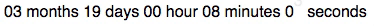

# react-date-countdown-timer

[](https://badge.fury.io/js/react-date-countdown-timer)

A basic react countdown timer component with a cool CSS transition animation.



You can see a demo app where you can play with props from [here](https://react-date-countdown-timer-dem.herokuapp.com/)

## Installation
> npm install --save react-date-countdown-timer
## Usage
```javascript
import DateCountdown from 'react-date-countdown-timer';
// ...
return <DateCountdown dateTo='January 01, 2023 00:00:00 GMT+03:00' callback={()=>alert('Hello')}  />;
```
## Properties
* dateTo(string)(required): target date to countdown
* dateFrom(string): date to start counting down (for passing server date etc.)
* callback(function): function to run after the countdown is completed (default null)
* mostSignificantFigure(string): most significant figure to show about the remaining time (default 'none')
* numberOfFigures(number): number of figures to show from mostSignificantFigure (default 6)
* locales(array(string)): locales strings for units (default ['year','month','day','hour','minute','second'])
* locales_plural(array(string)): locales strings for units' plural form (default ['years','months','days','hours','minutes','seconds'])
* noAnimate(bool): whether to animate the countdown or not (default false)


mostSignificantFigure can be one of these values:
* year
* month
* day
* hour
* min
* sec
* none (shows as many figures as available)
